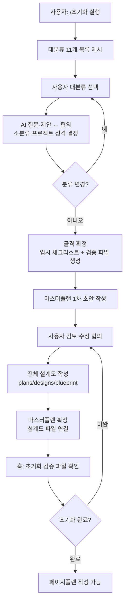
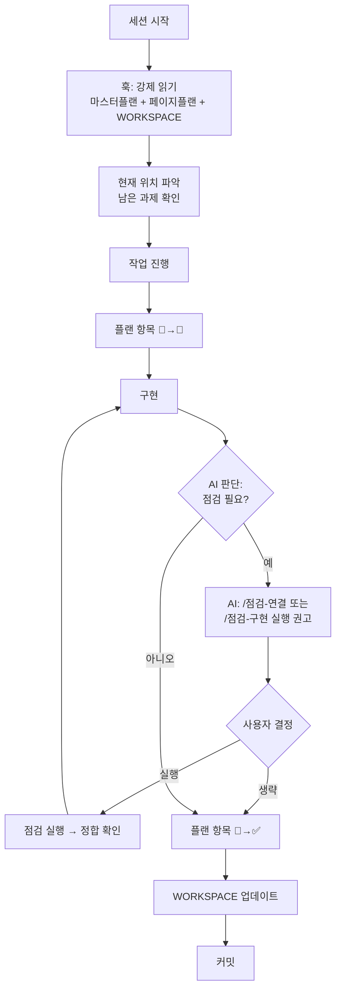
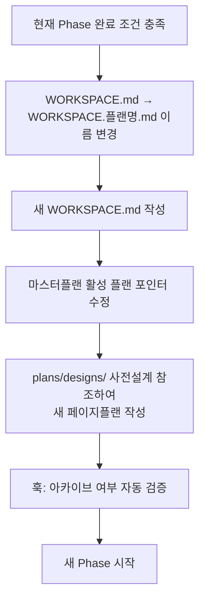
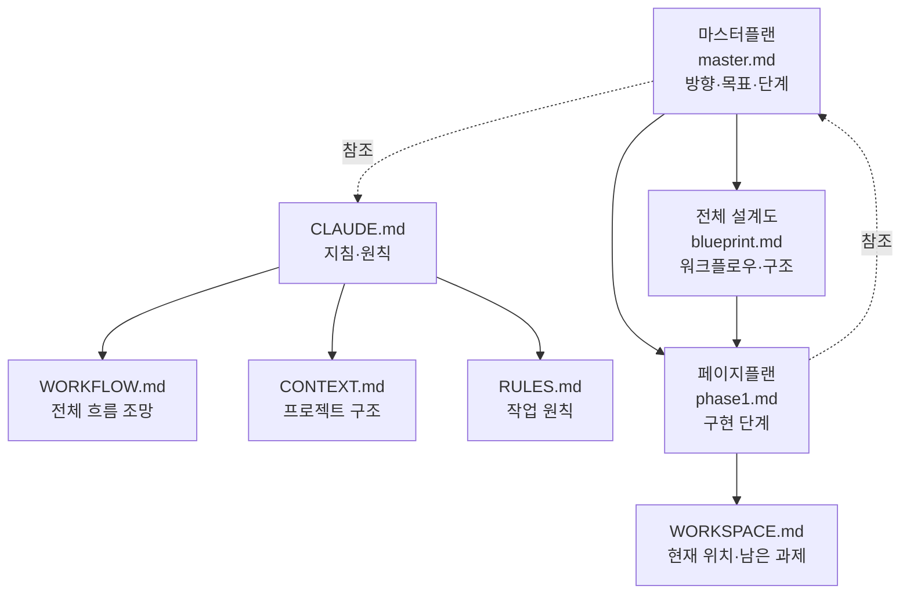

# WORKFLOW.md — 탬플릿 구조 전체 흐름 조망

> 이 파일은 프로젝트 주제와 무관한 탬플릿 구조 자체의 흐름을 담는다.
> 점진적으로 수정·완성된다. 완성 시점 = 탬플릿 완성 시점.
> 참조: `.claude/plans/template-master.md`

---

## 1. 신규 프로젝트 초기화 흐름



---

## 2. 세션 운영 흐름



---

## 3. 문제 발생 처리 흐름 (돌발상황 / 완료 페이지 사후보수)

```mermaid
flowchart TD
    A[문제 발생\n돌발상황 또는 완료 페이지 사후보수] --> B[새 플랜 생성\nhotfix 또는 신규 페이지플랜]
    B --> C[/점검-연결, /점검-구현 실행\n기존 설계도·지침과 정합 확인]
    C --> D[설계도 먼저 보완\n설계도가 항상 기준]
    D --> E[완료된 페이지플랜은 완료 상태 유지\n불변]
    E --> F[보완된 설계도 기준으로\n새 플랜·지침 일치]
    F --> G[구현]
    G --> H[WORKSPACE 업데이트 → 커밋]
```

---

## 4. Phase 전환 흐름



---

## 5. 문서 구조 및 연결 관계



---

> **범례**
> - 실선: 직접 연결·참조
> - 점선: 간접 참조
> - 이 파일은 현재 Phase 1 진행 중인 설계 기준이며 Phase 2 구현 완료 후 보완된다
